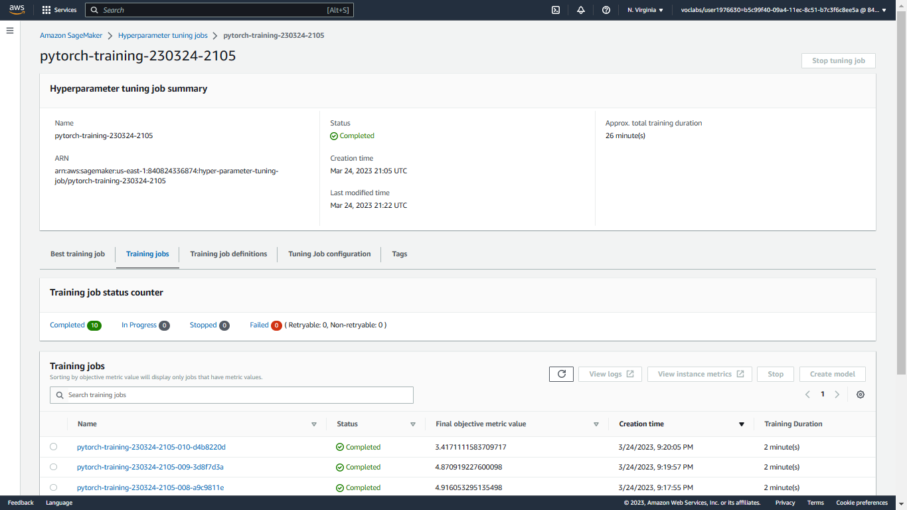
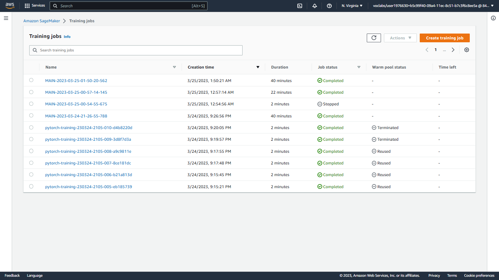
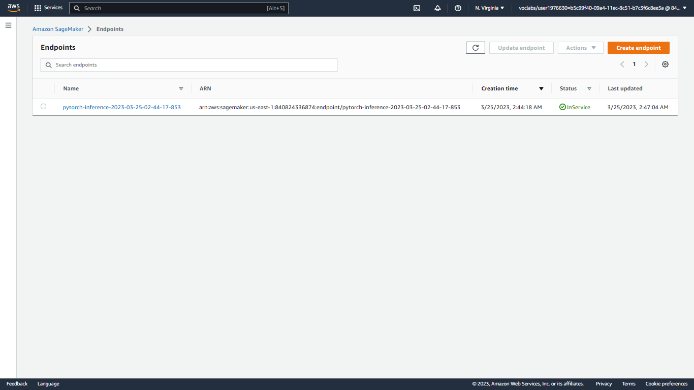

# Image Classification using AWS SageMaker

Use AWS Sagemaker to train a pretrained model that can perform image classification by using the Sagemaker profiling, debugger, hyperparameter tuning and other good ML engineering practices. This can be done on either the provided dog breed classication data set or one of your choice.

## Project Set Up and Installation

Enter AWS through the gateway in the course and open SageMaker Studio.</br>
Download the starter files.</br>
Download/Make the dataset available.</br>

## Dataset

The provided dataset is the dogbreed classification dataset which can be found in the classroom.
The project is designed to be dataset independent so if there is a dataset that is more interesting or relevant to your work, you are welcome to use it to complete the project.

### Access

Upload the data to an S3 bucket through the AWS Gateway so that SageMaker has access to the data.

## Hyperparameter Tuning

In this experiment, we used the ResNet50 model to perform image classification. We performed hyperparameter search, using the ```hpo.py``` script, to find the optimal values for the learning rate and batch size. The learning rate was searched over a continuous range from 0.001 to 0.1, while the batch size was searched over a categorical set of values including 16, 32, 64, 128, 256, and 512.</br>
Finally, we used the best values for the learning rate and batch size to train the model for 20 epochs.

</br>

## Training

The model was then trained using the ```train.py``` script. The model was trained for 20 epochs and completed with an accuracy of about 81% (which needs improvement :/ )</br>
</br>

## Debugging and Profiling

### Debugging

Model debugging in sagemaker is done using the smdebug library which is a part of the sagemaker python sdk. The library provides a set of hooks that can be used to capture the values of tensors at different points in the training process. The library also provides a set of rules that can be used to detect common issues in the training process.</br>
We used Amazon SageMaker Debugger for debugging the model to check how well the model is training. </br>
We registered the model by creating a SMDebug hook in the main function and passed this hook to the train and test functions with TRAIN and EVAL mode respectively. </br>
We also configured the Debugger Rules and Hook Parameters of what should be tracked in the notebook train_and_deploy.ipynb.</br>
If the debugging output showed an anamlous behaviour, we would have to debug the model and fix the issue.</br>
This could be done by viewing the cloudwatch logs and adjusting the code appropriately.</br>

### Profiling

Using Sagemaker Profiler, we monitored Instance metrics, GPU/CPU utilization and GPU/CPU memory utilization. </br>
To use Sagemaker Profiler we created profiler rules and configurations. The output is a HTML report. </br>

### Results

The profiler report revealed that the model trained for about 40 minutes.</br>
It also revealed that the model was underutilising the GPU.</br>
Recommendations were to either increase the batch size or use a smaller instance type.

## Model Deployment

The deployed model is a Pytorch CNN model that is based on the ResNet50 model that was finetuned for the Dog Breed Classification task.</br>
It has a linear fully connected output layer with output size 133 as there are 133 distinct dog breeds in the data provided.</br>
I used a learning rate of ```0.0010000000000000002```, batch size of ```16``` and an early stopping rounds of ```12``` as this gave best results according to the hyperparameter tuning.</br>
</br>
To query the enpoint we have to get the endpoint using:

```python
predictor = sagemaker.predictor.Predictor('pytorch-training-2023-03-25-02-44-17-853', 
                                           sagemaker_session=sagemaker_session)
```

The sample image needs to be transformed(resized, converted to a tensor and normalised) before it can be inputted to the predictor.predict() function.</br>
(Any transformation that was applied to the testing images will also need to be applied to the input images for prediction.)
