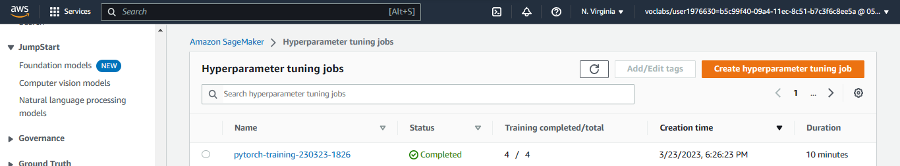
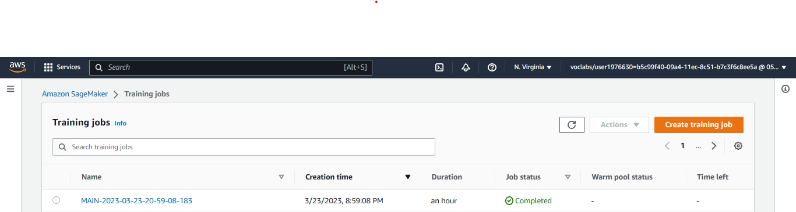

# Image Classification using AWS SageMaker

Use AWS Sagemaker to train a pretrained model that can perform image classification by using the Sagemaker profiling, debugger, hyperparameter tuning and other good ML engineering practices. This can be done on either the provided dog breed classication data set or one of your choice.

## Project Set Up and Installation

Enter AWS through the gateway in the course and open SageMaker Studio.
Download the starter files.
Download/Make the dataset available.

## Dataset

The provided dataset is the dogbreed classification dataset which can be found in the classroom.
The project is designed to be dataset independent so if there is a dataset that is more interesting or relevant to your work, you are welcome to use it to complete the project.

### Access

Upload the data to an S3 bucket through the AWS Gateway so that SageMaker has access to the data.

## Hyperparameter Tuning

In this experiment, we used the ResNet50 model to perform image classification. We performed a hyperparameter search to find the optimal values for the learning rate and batch size. The learning rate was searched over a continuous range from 0.001 to 0.1, while the batch size was searched over a categorical set of values including 16, 32, 64, 128, 256, and 512. 
Finally, we used the best values for the learning rate and batch size to train the model for 20 epochs.

 

## Debugging and Profiling

### Debugging

Model debugging in sagemaker is done using the smdebug library which is a part of the sagemaker python sdk. The library provides a set of hooks that can be used to capture the values of tensors at different points in the training process. The library also provides a set of rules that can be used to detect common issues in the training process. 
I used Amazon SageMaker Debugger for debugging the model to check how well the model training is happening.  
We registered the model by creating a SMDebug hook in the main function and passed this hook to the train and test functions with TRAIN and EVAL mode respectively.  
We also configured the Debugger Rules and Hook Parameters of what should be tracked in the notebook train_and_deploy.ipynb.  

### Profiling

Using Sagemaker Profiler, we monitored Instance metrics, GPU/CPU utilization and GPU/CPU memory utilization.  
To use Sagemaker Profiler we created profiler rules and configurations. The output is a HTML report.  

### Results

**TODO**: What are the results/insights did you get by profiling/debugging your model?

**TODO** Remember to provide the profiler html/pdf file in your submission.

## Model Deployment

**TODO**: Give an overview of the deployed model and instructions on how to query the endpoint with a sample input.

**TODO** Remember to provide a screenshot of the deployed active endpoint in Sagemaker.

## Standout Suggestions

**TODO (Optional):** This is where you can provide information about any standout suggestions that you have attempted.
